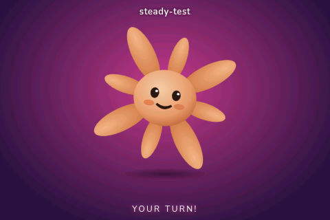

# Claude Notify

A little Claude character that lives on a Raspberry Pi's touchscreen and dances
whenever Claude Code on your Mac, Linux box, or Windows machine is waiting for
your input.

| Idle / bored | Dancing (input needed) |
| --- | --- |
|  |  |

When you're heads-down in another window and Claude Code is sitting there asking
"can I run this command?" or "what next?", the Pi spots it via a hook and the
little character springs to life with the name of the project that's waiting.

---

## How it works

```
┌──────────────────────────┐                 ┌──────────────────────────────┐
│ Mac / Linux / Windows    │                 │  Raspberry Pi @ host.local   │
│ running Claude Code      │                 │                              │
│                          │                 │  Flask server on :8080       │
│  ~/.claude/settings.json │                 │   ├─ POST /notify  → dance   │
│   ├─ Notification hook ──┼─── HTTP POST ──►│   ├─ POST /idle    → bored   │
│   ├─ Stop hook ──────────┼─── HTTP POST ──►│   └─ GET  /events  (SSE)     │
│   └─ UserPromptSubmit ───┼─── HTTP POST ──►│                              │
│                          │                 │  Chromium kiosk → index.html │
│  ~/.claude/hooks/        │                 │   └─ SVG mascot + CSS anims  │
│   ├─ notify-pi.sh / .ps1 │                 │                              │
│   └─ idle-pi.sh   / .ps1 │                 │                              │
└──────────────────────────┘                 └──────────────────────────────┘
```

Three Claude Code [hook events](https://docs.anthropic.com/en/docs/claude-code/hooks)
are wired up:

| Hook | Pi action | Triggers when |
| --- | --- | --- |
| `Notification` | Dance, with the `cwd` basename as the label | Claude Code surfaces a permission prompt or asks a question |
| `Stop` | Dance | Claude Code finishes a turn (it's now waiting on you) |
| `UserPromptSubmit` | Back to bored | You hit enter on a new prompt |

The Pi runs a tiny Flask server that holds the current state and streams changes
to the browser via Server-Sent Events. The browser is just Chromium in kiosk
mode rendering an SVG mascot with CSS keyframe animations.

---

## Hardware

This was built for a **Waveshare-style 3.5" SPI touchscreen** (the `tft35a`
overlay, 480×320 resolution), but anything that gives the Pi a framebuffer
will work — you'll just want to tweak the CSS for different aspect ratios.

What you need:

- A Raspberry Pi (Zero 2 W, 3, 4, or 5 — anything that can run Pi OS Desktop).
- A microSD card (8 GB+).
- A **3.5" SPI LCD** that uses the GoodTFT / Waveshare driver tree. The
  cheap eBay/AliExpress 320×480 boards branded "MPI3508" or "Waveshare 3.5
  RPi LCD (A)" generally work with this driver.
- Power supply for the Pi.
- A Mac (or any computer running Claude Code) on the same LAN as the Pi.

---

## Pi-side install (start to finish)

These instructions assume a fresh microSD card. If your Pi is already running
with the LCD working, skip to step 4.

### 1. Flash Raspberry Pi OS

Use the official [Raspberry Pi Imager](https://www.raspberrypi.com/software/).
Pick **Raspberry Pi OS (64-bit) — Desktop**.

In the imager's settings cog (or `Ctrl+Shift+X`), pre-configure:

- **Hostname:** `claude-notify` (this is what the Mac will talk to — if you
  pick something else, update the URL on the Mac side accordingly).
- **Username/password:** anything you like. The examples below assume
  username `jim`; substitute yours.
- **Wi-Fi:** join the same network as the Mac.
- **SSH:** enabled, public-key auth recommended.
- **Locale / keyboard:** whatever you prefer.

Flash the card, plug it into the Pi, power on. Give it a couple of minutes to
do the first-boot resize. SSH in once:

```sh
ssh jim@claude-notify.local
```

### 2. Enable auto-login to desktop

For the kiosk to start automatically the Pi needs to boot straight into a
graphical session as your user, no password prompt.

```sh
sudo raspi-config
```

In `1 System Options → S5 Boot / Auto Login`, pick **Desktop Autologin**.
Reboot.

### 3. Install the 3.5" LCD driver

The screen needs a kernel overlay (`tft35a`) plus an `fbcp` userspace mirror
to show the regular HDMI framebuffer on the SPI panel. The easiest path is
the community [`goodtft/LCD-show`](https://github.com/goodtft/LCD-show)
repo:

```sh
cd ~
git clone https://github.com/goodtft/LCD-show.git
chmod -R 755 LCD-show
cd LCD-show
sudo ./LCD35-show
```

That script edits `/boot/firmware/config.txt`, swaps to an X11 session
(the kiosk relies on X11, not Wayland), forces `hdmi_cvt 320 480 60 6 0 0 0`,
and reboots.

**After the reboot the screen will be in portrait (320 wide × 480 tall).**
This app is designed for **landscape (480 wide × 320 tall)** because that's
nicer for the mascot's wide arms. Rotate the framebuffer by editing
`/boot/firmware/config.txt`:

```
dtoverlay=tft35a:rotate=90
```

(Use `0`, `90`, `180`, or `270` — pick whichever orientation looks right when
the Pi is on your desk.) Reboot once more.

Verify by SSHing in and running:

```sh
DISPLAY=:0 xrandr | head -2
```

You should see `current 480 x 320` (or matching your rotation).

### 4. Install Claude Notify

```sh
cd ~
git clone https://github.com/jimbobbennett/claude-notify.git
cp -r claude-notify/pi ~/claude-notify-app    # avoid name clash with this repo dir
# OR if you prefer to work from the cloned repo directly:
#   keep the repo where it is and adjust the paths in start-kiosk.sh

# Use whichever layout you picked above. The autostart files assume
# the runtime lives at ~/claude-notify/, so set up a symlink or copy:
ln -snf ~/claude-notify-app ~/claude-notify
```

If you want to keep things simple, just clone the repo's `pi/` contents
straight into `~/claude-notify/`:

```sh
mkdir -p ~/claude-notify
cp -r claude-notify/pi/. ~/claude-notify/
chmod +x ~/claude-notify/start-kiosk.sh
```

Python and Flask are usually pre-installed on Pi OS Desktop. Confirm:

```sh
python3 -c 'import flask; print(flask.__version__)'
```

If Flask is missing:

```sh
sudo apt update
sudo apt install -y python3-flask
```

### 5. Test the server manually

```sh
cd ~/claude-notify
python3 server.py
```

From any machine on the same LAN:

```sh
curl http://claude-notify.local:8080/state
# {"message":"","seq":0,"session":"","state":"idle"}

curl -X POST http://claude-notify.local:8080/notify
# {"message":"","seq":1,"session":"","state":"dancing"}
```

Open `http://claude-notify.local:8080/` in your browser and you should see
the mascot. Tap (or click) once to toggle states for a quick smoke test.

`Ctrl-C` the server when you're satisfied.

### 6. Install the autostart entry

When you log in to the desktop, LXDE's autostart directory runs every
`.desktop` file it finds. Drop the supplied one in:

```sh
mkdir -p ~/.config/autostart
cp ~/claude-notify/claude-notify-kiosk.desktop ~/.config/autostart/
```

The `.desktop` file just calls `~/claude-notify/start-kiosk.sh`, which:

- Waits for the X server to come up (`xset q`).
- Disables screen blanking and DPMS.
- Starts the Flask server if it isn't already running.
- Launches Chromium in kiosk/`--app` mode pointed at `http://localhost:8080`.
- Restarts Chromium if it dies, with **exponential backoff** and a long
  cool-down after repeated fast failures so a broken environment can't pin
  the Pi's CPU.

Reboot:

```sh
sudo reboot
```

When the Pi comes back you should see the character idling on the LCD.

### Optional: hide the cursor

```sh
sudo apt install -y unclutter
```

`start-kiosk.sh` picks `unclutter` up automatically if present.

---

## Client-side install (macOS, Linux, Windows)

The "client" is whatever machine runs Claude Code. The supplied hook
scripts are plain POSIX shell — they work as-is on **macOS**, **Linux**,
and on **Windows under WSL or Git Bash**. Windows users who prefer native
PowerShell can use the inline alternative further down.

### Prerequisites

Both scripts use `curl` (everywhere by default) and `jq` (to extract the
`cwd` field from Claude Code's hook payload). `jq` is optional — without
it the Pi still dances, it just won't show the session label.

| OS | Install `jq` |
| --- | --- |
| macOS | `brew install jq` (often already present) |
| Debian / Ubuntu / Raspberry Pi OS | `sudo apt install jq` |
| Fedora / RHEL | `sudo dnf install jq` |
| Arch | `sudo pacman -S jq` |
| Windows (winget) | `winget install jqlang.jq` |
| Windows (scoop) | `scoop install jq` |
| Windows (choco) | `choco install jq` |

### Claude Code settings location

Claude Code reads its user-level settings from the same path on every
platform — your home directory. Below, `~` and `$HOME` mean:

| OS | `$HOME` resolves to |
| --- | --- |
| macOS | `/Users/<you>` |
| Linux | `/home/<you>` |
| Windows (Git Bash / WSL) | `/c/Users/<you>` or your WSL `$HOME` |
| Windows (PowerShell) | `$env:USERPROFILE` (e.g. `C:\Users\<you>`) |

Settings file: `~/.claude/settings.json`. Hooks directory:
`~/.claude/hooks/`. Both are created on first use if they don't exist.

### 1. Copy the hook scripts

#### macOS / Linux / WSL / Git Bash

```sh
mkdir -p ~/.claude/hooks
cp client/notify-pi.sh ~/.claude/hooks/
cp client/idle-pi.sh   ~/.claude/hooks/
chmod +x ~/.claude/hooks/notify-pi.sh ~/.claude/hooks/idle-pi.sh
```

Quick test:

```sh
echo '{"cwd":"/path/to/some-project","hook_event_name":"Notification"}' \
  | ~/.claude/hooks/notify-pi.sh
sleep 1
curl http://claude-notify.local:8080/state
# {"message":"","seq":N,"session":"some-project","state":"dancing"}
```

#### Windows (native PowerShell, no Git Bash / WSL)

If you don't want a bash environment on Windows, drop these two files
into `$env:USERPROFILE\.claude\hooks\` instead. They use only built-in
PowerShell:

**`notify-pi.ps1`**

```powershell
$ErrorActionPreference = 'SilentlyContinue'
$url = if ($env:CLAUDE_NOTIFY_URL) { $env:CLAUDE_NOTIFY_URL } else { 'http://claude-notify.local:8080' }
$raw = [Console]::In.ReadToEnd()
$session = ''
$message = ''
try {
  $obj = $raw | ConvertFrom-Json
  if ($obj.cwd)     { $session = Split-Path $obj.cwd -Leaf }
  if ($obj.message) { $message = $obj.message }
} catch {}
$body = @{ session = $session; message = $message } | ConvertTo-Json -Compress
Invoke-RestMethod -Uri "$url/notify" -Method Post -ContentType 'application/json' -Body $body -TimeoutSec 2 | Out-Null
exit 0
```

**`idle-pi.ps1`**

```powershell
$ErrorActionPreference = 'SilentlyContinue'
$url = if ($env:CLAUDE_NOTIFY_URL) { $env:CLAUDE_NOTIFY_URL } else { 'http://claude-notify.local:8080' }
Invoke-RestMethod -Uri "$url/idle" -Method Post -TimeoutSec 2 | Out-Null
exit 0
```

Test from PowerShell:

```powershell
'{"cwd":"C:\\Users\\you\\some-project","hook_event_name":"Notification"}' `
  | & "$env:USERPROFILE\.claude\hooks\notify-pi.ps1"
Start-Sleep 1
Invoke-RestMethod http://claude-notify.local:8080/state
```

### Overriding the Pi URL

If your Pi isn't at `claude-notify.local`, set `CLAUDE_NOTIFY_URL` to its
address. The scripts pick it up from the environment.

| Shell | Persistent override |
| --- | --- |
| bash / zsh (macOS, Linux, Git Bash, WSL) | `echo 'export CLAUDE_NOTIFY_URL=http://192.168.1.42:8080' >> ~/.bashrc` (or `~/.zshrc`) |
| fish | `set -Ux CLAUDE_NOTIFY_URL http://192.168.1.42:8080` |
| PowerShell | `[Environment]::SetEnvironmentVariable('CLAUDE_NOTIFY_URL','http://192.168.1.42:8080','User')` |

You can also just edit the URL in the script files directly.

### 2. Wire the hooks into Claude Code

Edit `~/.claude/settings.json` (or `%USERPROFILE%\.claude\settings.json`
on Windows) and add a `hooks` block. Merge with any existing keys.

**macOS / Linux / WSL / Git Bash** — Claude Code's default shell on these
platforms is bash, so `$HOME` expands correctly:

```json
{
  "hooks": {
    "Notification": [
      {
        "hooks": [
          { "type": "command", "command": "$HOME/.claude/hooks/notify-pi.sh" }
        ]
      }
    ],
    "Stop": [
      {
        "hooks": [
          { "type": "command", "command": "$HOME/.claude/hooks/notify-pi.sh" }
        ]
      }
    ],
    "UserPromptSubmit": [
      {
        "hooks": [
          { "type": "command", "command": "$HOME/.claude/hooks/idle-pi.sh" }
        ]
      }
    ]
  }
}
```

**Native Windows (PowerShell variant)** — add `"shell": "powershell"` to
each hook entry and point at the `.ps1` files:

```json
{
  "hooks": {
    "Notification": [
      {
        "hooks": [
          { "type": "command", "shell": "powershell", "command": "& \"$env:USERPROFILE\\.claude\\hooks\\notify-pi.ps1\"" }
        ]
      }
    ],
    "Stop": [
      {
        "hooks": [
          { "type": "command", "shell": "powershell", "command": "& \"$env:USERPROFILE\\.claude\\hooks\\notify-pi.ps1\"" }
        ]
      }
    ],
    "UserPromptSubmit": [
      {
        "hooks": [
          { "type": "command", "shell": "powershell", "command": "& \"$env:USERPROFILE\\.claude\\hooks\\idle-pi.ps1\"" }
        ]
      }
    ]
  }
}
```

Restart Claude Code (or open the `/hooks` menu once to force a reload —
Claude Code only watches files that existed when the session started).

That's it. Open any project, ask Claude to do something that needs
permission, and the Pi should light up.

---

## Customization

- **Different host / port:** set `CLAUDE_NOTIFY_URL` in your shell env, or
  edit `client/notify-pi.sh` (and your local PowerShell copy on Windows).
- **Different session label:** the script forwards `cwd` basename by
  default. Edit the `jq` expression in `client/notify-pi.sh` to send
  something else — e.g. `session: (.session_id // "")` or a fixed string.
  In the PowerShell version, change the `Split-Path $obj.cwd -Leaf` line.
- **Auto-idle timeout:** if Claude Code crashes the Pi could be stuck
  dancing forever. The server falls back to idle after 10 minutes; tune
  `AUTO_IDLE_SECONDS` in `pi/server.py`.
- **Mascot / colours / animations:** all in `pi/static/style.css` and
  `pi/static/index.html`. Push the changed file with `scp` and kill
  Chromium — the kiosk loop reloads it within a few seconds.
- **Sound:** Chromium can play `<audio>`. Drop a chime in `pi/static/`,
  reference it in `index.html`, and play it on state change in `app.js`.

---

## Troubleshooting

**Pi screen is white / blank after boot.**
Usually a Chromium profile that crashed previously. Wipe it:

```sh
rm -rf ~/.config/claude-notify-chromium
~/claude-notify/start-kiosk.sh    # or just reboot
```

**Screen orientation is wrong.**
Edit `/boot/firmware/config.txt` and change `dtoverlay=tft35a:rotate=N` to
`0`, `90`, `180`, or `270`. Reboot.

**Hooks aren't firing.**
Claude Code only watches settings files that existed when the session
started. Either restart Claude Code or open `/hooks` to force a reload.
Test the hook scripts directly first:

```sh
echo '{}' | ~/.claude/hooks/notify-pi.sh; sleep 1
curl http://claude-notify.local:8080/state
```

**`curl` sometimes times out resolving `claude-notify.local`.**
mDNS resolvers can get cranky. The Pi is still reachable — try the raw
IP, then flush the cache:

- macOS: `sudo dscacheutil -flushcache; sudo killall -HUP mDNSResponder`
- Linux: `sudo systemctl restart avahi-daemon` (if installed)
- Windows: `ipconfig /flushdns`

If `.local` resolution doesn't work on Windows at all, install
[Bonjour Print Services](https://support.apple.com/kb/DL999) or just
hard-code the Pi's IP via `CLAUDE_NOTIFY_URL`.

**Animation is jerky.**
Chromium is software-rendering on the Pi (most small SPI LCDs can't
hardware-accelerate). The supplied CSS already drops the expensive bits
(filter-based pulses, per-element wiggles). If you add more, prefer
`transform`-only keyframes and `will-change: transform` on the animated
element.

**Pi seems to lock up.**
Check `~/claude-notify/logs/kiosk.log` after reboot. The hardened
`start-kiosk.sh` logs every Chromium launch and cool-down. Repeated
"fast failure" entries point at an environment problem (no X, bad GPU
options, etc.) rather than a code bug.

**Logs in general.**
Everything lands in `~/claude-notify/logs/`:

- `kiosk.log` — what the autostart script is doing.
- `server.log` — Flask stdout/stderr.
- `chromium.log` — Chromium stderr (capped at 256 KB).

---

## Repo layout

```
.
├── pi/
│   ├── server.py                       # Flask server with /notify, /idle, /events
│   ├── start-kiosk.sh                  # Autostart entry point (hardened)
│   ├── claude-notify-kiosk.desktop     # LXDE autostart file
│   └── static/
│       ├── index.html                  # SVG mascot + status / session label
│       ├── style.css                   # Idle bob, bored cycle, dance
│       └── app.js                      # SSE client, state machine
├── client/                             # Hook scripts for the Claude-Code host
│   ├── notify-pi.sh                    # POST /notify, forwards cwd basename
│   └── idle-pi.sh                      # POST /idle
│                                       # (Windows-PowerShell variants are
│                                       #  inline in the README.)
└── docs/
    ├── idle.png
    └── dancing.png
```

---

## License

MIT — see [`LICENSE`](LICENSE).
